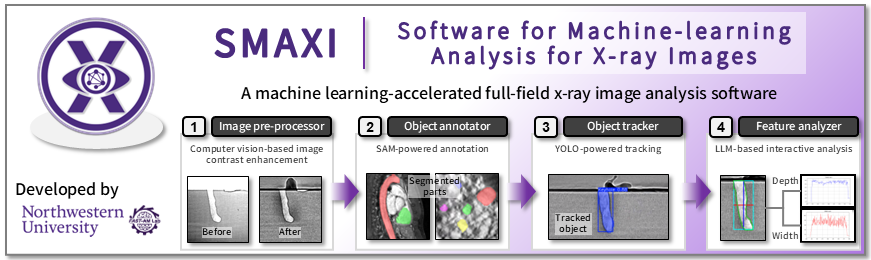
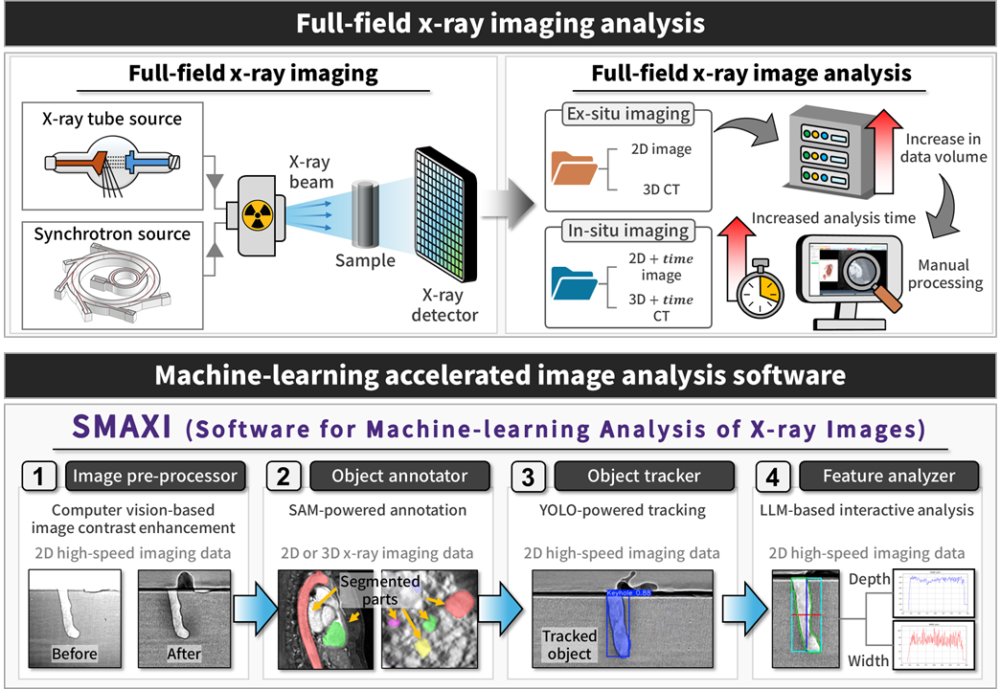

# SMAXI

**SMAXI (Software for Machine-learning Analysis of X-ray Images): An Open-source, End-to-End, AI-Powered Platform**

Developed by **FAST-AM Lab**, Northwestern University, Evanston, IL (Department of Mechanical Engineering)  
[Visit Lab Website](https://fast-am.mech.northwestern.edu/)



---

## 📖 Overview

**SMAXI (Software for Machine-learning Analysis of X-ray Images)** is an open-source platform designed to address the "Big Data" bottlenecks inherent in modern full-field X-ray imaging. While advancements in both laboratory-scale x-ray sources and high-energy synchrotron facilities enable rapid, high-resolution data acquisition, the manual processing of these massive, multi-dimensional datasets has become prohibitively tedious.

SMAXI solves this by providing a robust, user-friendly pipeline for processing transient high-speed 2D x-ray video, 3D computed tomography (CT) data, and 4D in-situ tomography.

Unlike closed-source commercial alternatives that restrict customization, SMAXI is fully extensible and integrates state-of-the-art machine learning foundational models (SAM 2, YOLOv12, Llama 3) to automate and accelerate image stabilization, precise object annotation, dynamic tracking, and complex geometric feature analysis.

## 🖼️ Diagram
The diagram below summarizes the core architecture and key modules of the SMAXI software.



---

## ✨ Key Features

SMAXI is structured into four primary analytical modules, supplemented by advanced auxiliary tools:

### 1. Image Pre-processor (Image Stabilization & Normalization)
* **Thermal Drift Correction:** Computer vision-assisted automated stabilization of high-speed x-ray images to track and correct for thermal drift-triggered surface shifts (e.g., substrate's thermal expansion during laser powder bed fusion).
* **Image Normalization:** Background removal and contrast enhancement designed to resolve vague features and isolate phenomena like keyholes and melt pools. Supports both continuous grayscale and binary normalization, with optional CLAHE illumination flattening.

### 2. ML-Powered Object Segmenter
* **Zero-Shot Detection:** Utilizes foundational **Segment Anything Models (SAM 1 & SAM 2)** for robust, prompt-based 2D, 3D, and 4D object segmentation. This drastically reduces the tedious manual labeling overhead required by traditional polygon methods, replacing it with efficient point-and-click or bounding-box interactions.

### 3. ML-Powered Object Tracker
* **Object Tracking:** Implements YOLOv8 and YOLOv12 architectures trained directly on SAM-generated masks for automated, continuous high-speed tracking of dynamic target objects (e.g., rapidly evolving keyhole vapor depressions during laser powder bed fusion process or movement of tool pin during friction stir welding process).

### 4. Interactive Geometry Feature Analyser
* **Geometric Quantification:** Automatically extracts, quantifies, and plots temporal geometric metrics—such as object depth, width, area, and aspect ratio—derived directly from the tracking data.
* **LLM Integration:** Automatically extracts, quantifies, and plots temporal geometric metrics—such as object deptFeatures a built-in interactive conversational assistant powered by Llama 3 (via Ollama). Users can seamlessly query their extracted datasets in natural language to quickly retrieve statistical insights and summaries.width, area, and aspect ratio—derived directly from the tracking data.

### Auxiliary feature
* **Transient Event Tagger:** A dedicated interface for manually identifying, tagging, and exporting localized transient events (e.g., spatter, bubble formation, or pore generation) with precise spatial and temporal coordinates.

---

## 📦 Installation Package Explanation

Due to large file sizes, the complete dataset, source code package, and tutorial materials are hosted externally. Python files can be found in the repository. If any modifications are made to Python files in the repository, users can seamlessly replace them with the updated files from the Google Drive below.


### 🔗 [Download All Assets Here (Google Drive Link)](https://drive.google.com/drive/folders/1woC6zvyxjAKdQ0fuNuI6pKW8LH5Ltft8?usp=sharing)

**The external repository contains:**

* 📂 **1. Root folder:** The core software directory containing the main Python scripts, README.txt, requirements.txt, SAM 1&2 models 
* 📂 **2. GUI Assets:**
    * Background image for GUI setup
    * Logo image for GUI setup
* 📂 **3. Sample Input Files:**
    * High-speed X-ray image (cine file)
    * High-speed X-ray image (thermal drift correction demo)
    * Labeled mask data for YOLO training
    * X-ray tomography 2D images (images from TomoBank)
    * X-ray tomography 3D image (human head opendata, MSD Cardiac dataset)
* 📂 **4. Sample Output Files:**
    * CSV file for geometry analysis
    * High-speed X-ray image (normalized output)
    * Trained YOLO model (`.pt` file)
* 📚 **Tutorials:**
    * Tutorial Slides (`.pdf` and `.pptx`)
    * X-ray image analysis program tutorial video (`.mp4` - Recorded Jan 22, 2026)


---

## 🛠️ Software Installation

**Target System:** Windows / Linux / macOS  
**Recommended Environment:** Conda (Anaconda or Miniconda)

### 1. Prerequisites & File Structure
Before installing, ensure your project folder is organized as follows:
* **`1. Python code/`**: Contains the source code (e.g., `main.py`).
* **`models/`**: Stores SAM models (e.g., `sam_vit_b_01ec64.pth`).
* **`requirements.txt`**: List of required Python libraries.

### 2. Installation Steps (Conda)

**Step 1: Create the Environment** Open your terminal (Anaconda Prompt) and run the following command to create a new environment named `xray_image_software` with Python 3.12:
```bash
conda create -n xray_image_software python=3.12 pip spyder
```
**Step 2: Activate the Environment** 
```bash
conda activate xray_image_software
```

**Step 3: Install Python Libraries** Navigate to the root folder (where requirements.txt is located) and install dependencies:
```bash
cd /d "Modify this path (PATH_TO_YOUR_SOFTWARE_FOLDER)_(file path must end with/1. Root folder)"
pip install -r requirements.txt
```

**Step 4: Install Llama 3 (Optional)** This software uses Ollama for the local LLM chat feature.

(1) Download Ollama from this link. 
[Visit Ollama website](https://ollama.com/download)

(2) Once installed, run this command in your terminal:
```bash
ollama pull llama3
```
## 🚀 Usage

Follow the steps below to launch the software using your preferred IDE.

### [Option A] Using Visual Studio Code
1. **Open the Project:** Launch VS Code and open the folder `1. Python code`.
2. **Select Interpreter:** * *Note: Ensure Python is installed prior to this step.*
   * Press `Ctrl+Shift+P` (Windows/Linux) or `Cmd+Shift+P` (Mac) to open the Command Palette.
   * Type **"Python: Select Interpreter"** and select it.
   * Choose the `xray_image_software` environment from the list.
3. **Run the Application:**
   * Open `main.py` from the file explorer.
   * Click the **Play** button in the top-right corner of the editor.

### [Option B] Using Spyder
1. **Activate the Environment:** Open your terminal or Anaconda Prompt and run:
   ```bash
   conda activate xray_image_software
   ```
2. **Launch Spyder:** Start the IDE by typing
   ```bash
   spyder
   ```
3. **Run the Software**
   * Once Spyder opens, open main.py from the file menu.
   * Press F5 or click the green Run icon in the toolbar.
   

<br />
<br />
Below is the tutorial video (Video does not cover recently-updated featuers, but would assist in installing the software).
<br />

[](https://youtu.be/K2RnguNqBVk)


## 📬 Contact

Dukyong Kim: kdy0414@u.northwestern.edu

## 🧠 AI Models & Acknowledgments

This software leverages state-of-the-art artificial intelligence models to achieve high-precision analysis:

* **SAM (Segment Anything Model)** by Meta AI – Integrated for zero-shot image segmentation and annotation.
* **YOLO-seg (You Only Look Once)** by Ultralytics – Integrated for high-speed object tracking and instance segmentation.
* **Llama 3** by Meta AI – Powering the local "Chat with Data" and geometric feature analysis.
* **Google Gemini** – Utilized for software architecture planning, code development, and optimization.
